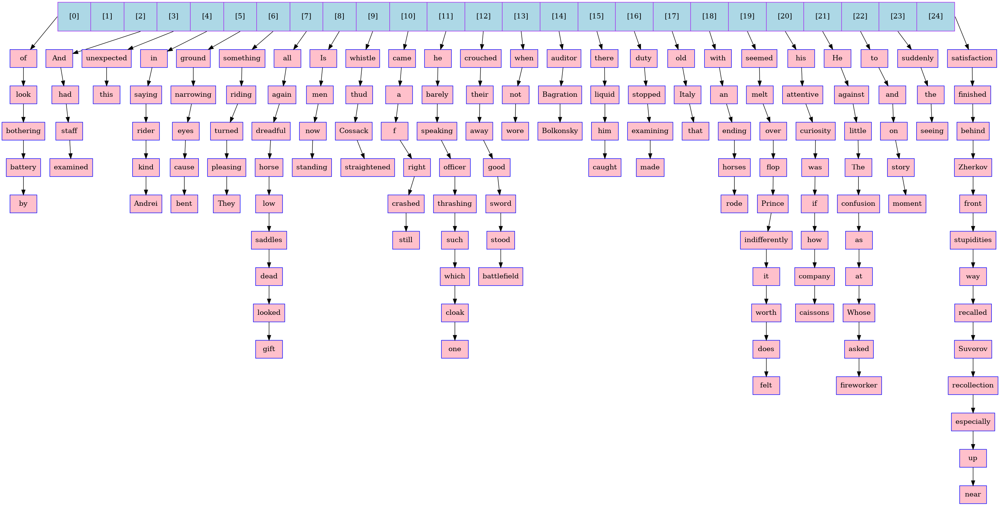
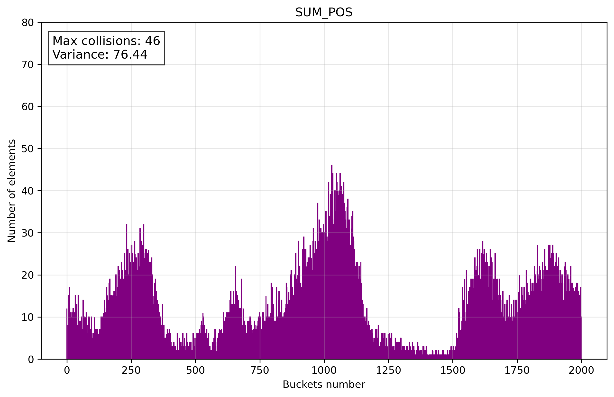

# Hash Table



# General information

Lab work on programming in the [ded32](https://github.com/ded32) course on optimizing search in a hash table.

**Hash Table:** A data structure for fast key-value storage and retrieval using a hash function, with average O(1) time for insert and search (sometimes delete).

**Hash Function:** Maps keys to array indices. A good hash function minimizes collisions and distributes keys evenly.

**Types of Hash Tables:**

 - **Chaining:** Collisions are resolved by storing elements in a linked list at each index. Simple and effective but may use more memory *(I use this type!)*.

 - **Open Addressing:** Stores all elements in the array. Collisions resolved by probing. Memory-efficient but degrades with high load.

 - **Perfect Hashing:** Uses a collision-free hash function for a static key set. Ideal `O(1)` performance but complex to construct.

 - **Cuckoo Hashing:** Uses two hash functions. Elements may displace others, moving them to alternate positions.

**Collision:** When different keys map to the same index. Resolved using techniques like **chaining** or **open addressing**.

**Load Factor** is the ratio of the number of elements in a hash table to its total number of slots (array size).

Typically, a **load factor of `0.7` (`70%`) is ideal—balancing memory usage and performance**.

# Table of Contents

- [Research of hash functions](#research-of-hash-functions)
    - [LENGTH](#length)
    - [ASCII](#ascii)
    - [SUM_POS](#sum_pos)
    - [MULT](#mult)
    - [DJB2](#djb2)
    - [SDBM](#sdbm)
    - [CRC32](#crc32)
    - [FNV_1a](#fnv_1a)
    - [JENKINS](#jenkins)
    - [XXHASH](#xxhash)
    - [Conclusion](#conclusion)
- [Hardware](#hardware)
- [Choosing profiler and setting targets](#choosing-profiler-and-setting-targets)
- [Optimization of hash table](#optimization-of-hash-table)
    - [Optimization of input data](#optimization-of-input-data)
    - [strcmp optimization](#strcmp-optimization)
    - [Hash function optimization](#hash-function-optimization)
    - [Hash function optimization. Part 2](#hash-function-optimization-part-2)
    - [Summary](#summary)
- [Conclusions](#conclusions)

# Research of hash functions

1. To investigate hash functions, I load `Leo Tolstoy's text “War and Peace”` into a hash table.

2. I load the number of buckets (`20k`) and the number of elements in it in `data.txt`.

3. **Load factor** is `1.5`. (For training purposes, so that assembly optimizations are more **visible**)

3. I use `histo.py` to build histograms using the data from `data.txt`.

## LENGTH

Hash = length of key.

<details>
<summary>Click to expand/collapse</summary>

```C
static inline uint32_t hash_LENGTH (const char* key)
{
    uint32_t hash = 0;
    while (*key++)
        hash++;

    return hash;
}
```
</details>


> [!NOTE]
> Histogram is scaled down on the **x-axis** for better visibility.

Terrible hash function, **no comments**.

## ASCII

Hash = sum of ASCII codes of each symbol.

<details>
<summary>Click to expand/collapse</summary>

```C
static inline uint32_t hash_ASCII (const char* key)
{
    uint32_t hash = 0;
    while (*key)
        hash += (uint32_t) ((unsigned char) *key++);

    return hash;
}
```
</details>


This function is already better, but the **distribution over the buckets is uneven**.

## SUM_POS

Hash = sum of each character multiplied by its position in the string.

<details>
<summary>Click to expand/collapse</summary>

```C
static inline uint32_t hash_SUM_POS (const char* key)
{
    uint32_t hash = 0;
    int pos = 1;
    while (*key)
        hash += (uint32_t) ((unsigned char)*key++ * pos++);

    return hash;
}
```
</details>



Improved distribution, but **it's still bad**.

## MULT

Hash = multiply the current hash by 31 and add the next character.

<details>
<summary>Click to expand/collapse</summary>

```C
static inline uint32_t hash_MULT (const char* key)
{
    uint32_t hash = 1;
    while (*key)
    {
        hash *= 31;
        hash += (unsigned char)*key++;
    }

    return hash;
}
```
</details>


Introduces multiplication between iterations, **potentially improving distribution** but increasing computational cost.

## DJB2

Hash = combines a left shift and addition to multiply the hash by 33, then adds the next character in each iteration.

<details>
<summary>Click to expand/collapse</summary>

```C
static inline uint32_t hash_DJB2 (const char* key)
{
    uint32_t hash = 5381;
    unsigned char c = 0;

    while ((c = (unsigned char) *key++) != 0)
        hash = (((hash << 5) + hash) + (uint32_t) c);

    return hash;
}
```
</details>


Uses a more **effective multiplication factor (33)** and a **non-zero initial value**.

## SDBM

Hash = adding the character to a combination of shifted hash values (left by 6 and 16 bits) and subtracting the original hash.

<details>
<summary>Click to expand/collapse</summary>

```C
static inline uint32_t hash_SDBM (const char* key)
{
    uint32_t hash = 0;
    int c = 0;
    while ((c = *key++))
        hash = (uint32_t) c + (hash << 6) + (hash << 16) - hash;

    return hash;
}
```
</details>


Employs more complex bit shifts and subtraction, which can enhance **the avalanche effect** but may be slower due to additional operations.

> [!NOTE]
> **Avalanche Effect**: A property of a hash function where a small change in the input *(e.g., flipping a single bit)* causes a significant and unpredictable change in the output hash.

## CRC32

Hash = using a lookup table and computing a cyclic redundancy check by XOR'ing the hash with each character and shifting the result (poly = `0x1EDC6F41`).

<details>
<summary>Click to expand/collapse</summary>

```C
static inline uint32_t hash_CRC32 (const char* key)
{
    uint32_t hash = 0xFFFFFFFF;
    while (*key)
    {
        uint8_t byte = (unsigned char)*key++;
        hash = (hash >> 8) ^ crc32_table[(hash ^ byte) & 0xFF];
    }

    return hash ^ 0xFFFFFFFF;
}
```
</details>


**Leverages a precomputed table** for **better distribution** and error detection, though **it is slower** due to table lookups and bitwise operations.

## FNV_1a

Hash = XORs the hash with each character and multiplies the result by a prime number (`16777619`) in each iteration.

<details>
<summary>Click to expand/collapse</summary>

```C
static inline uint32_t hash_FNV_1a (const char* key)
{
    uint32_t hash = 2166136261u;
    while (*key)
    {
        hash ^= (unsigned char)*key++;
        hash *= 16777619u;
    }

    return hash;
}
```
</details>


Avoids table lookups, making it **faster** while maintaining good distribution through the use of a prime multiplier.

## JENKINS

Hash = adds each character to the hash, shifts it left by `10`, XORs with a right shift by `6`, and finalizes with additional shifts and XORs.

<details>
<summary>Click to expand/collapse</summary>

```C
static inline uint32_t hash_JENKINS (const char* key)
{
    uint32_t hash = 0;
    while (*key)
    {
        hash += (unsigned char)*key++;
        hash += (hash << 10);
        hash ^= (hash >> 6);
    }

    hash += (hash << 3);
    hash ^= (hash >> 11);
    hash += (hash << 15);

    return hash;
}
```
</details>


Incorporates **more aggressive** bit mixing with shifts and XORs, improving the **avalanche effect** and **reducing collisions** at the cost of extra operations.

## XXHASH

Hash = multiplies each character by a seed, applies a rotation (left shift by `17`), multiplies by a constant, and finalizes with a series of `XORs` and multiplications.

<details>
<summary>Click to expand/collapse</summary>

```C
static inline uint32_t hash_XXHASH (const char* key)
{
    uint32_t hash = 0;
    uint32_t seed = 0x1e3b2d4f;
    while (*key)
    {
        uint32_t c = (unsigned char)*key++;
        hash += c * seed;
        hash = (hash << 17) | (hash >> 15);
        hash *= 0x9e3779b1;
    }

    hash ^= hash >> 15;
    hash *= 0x85ebca77;
    hash ^= hash >> 13;
    hash *= 0xc2b2ae3d;
    hash ^= hash >> 16;

    return hash;
}
```
</details>


Uses a seed and **more complex finalization**.

## Conclusion

<table>
    <thead>
        <tr>
            <th style="text-align: center">Hash function</th>
            <th style="text-align: center">Variance</th>
        </tr>
    </thead>
    <tbody>
        <tr>
            <td style="text-align: center"> LENGTH</td>
            <td style="text-align: center"> 27446.41</td>
        </tr>
            <td style="text-align: center"> ASCII </td>
            <td style="text-align: center"> 266.65</td>
        </tr>
            <td style="text-align: center">SUM_POS</td>
            <td style="text-align: center"> 76.44</td>
        </tr>
            <td style="text-align: center"> MULT</td>
            <td style="text-align: center"> 11.09</td>
        </tr>
            <td style="text-align: center"> DJB2</td>
            <td style="text-align: center"> 11.62</td>
        </tr>
            <td style="text-align: center"> SDBM</td>
            <td style="text-align: center"> 11.27</td>
        </tr>
            <td style="text-align: center"> CRC32</td>
            <td style="text-align: center"> 11.20</td>
        </tr>
            <td style="text-align: center"> FNV_1a</td>
            <td style="text-align: center"> 11.07</td>
        </tr>
            <td style="text-align: center"> JENKINS</td>
            <td style="text-align: center"> 10.97</td>
        </tr>
            <td style="text-align: center"> XXHASH </td>
            <td style="text-align: center"> 11.51</td>
        </tr>
    </thead>
</table

Based on the **calculated variance**, the **JENKINS** hash function demonstrates the **lowest variance** among the provided list, indicating a **more uniform distribution** of hash values, which makes it one of the best choices for **minimizing collisions** and ensuring **efficient performance**.

**BUT**, **CRC32** matches the hardware better (it exists as a separate assembler instruction).  **CRC32** is statistically slightly worse than **JENKINS**, but they are very similar. For JENKINS or any other function, we would have to implement **complex logic in assembly language**, which we don't have enough instructional time for.

# Hardware

- **Laptop:** `HP 14s-fq0046ur 14"`
- **Processor:** `AMD Ryzen 5 4500U 2.3 GHz (4 GHz in Turbo)`
- **OS:** `Ubuntu 24.04.2 LTS`
- **RAM:** `16GB, DDR4, 2400MHz SO-DIMM`
- **Disk:** `512GB SSD`
- **Number of processor cores:** `6`
- **L2 cache size:** `3 MB`
- **L3 cache size:** `8 MB`
- **Compiler:** `g++ 13.3.0`

All measurements will be performed at the same processor temperature range from **40°C to 60°C** and with the charger connected.

# Choosing profiler and setting targets

For the first profiling of the base version of the program, we will use `valgrind 3.22.0` (to visualize the profiling data: `kcachegrind 23.08.5`) and `perf 6.11.11` (for convenience, we will use the `perf` `hotspot 1.3.0` graphical handler).

Our goal is to determine which profiler is better for our particular program.

Using `valgrind` we get the program's hot spots:


And using `perf`:


`Perf` did a better job of determining which functions were hot in our program, while `valgrind` determined all function calls from **main**.

> [!NOTE]
> It is also worth considering in the comparison that `perf` uses **hardware counters** to measure CPU cycles, including kernel activity. `valgrind (callgrind)`, on the other hand, **emulates execution to count instructions executed (IR)**, offering detailed code-level analysis, but with significant slowdown and limited kernel visibility.

For this reason, **we will use `perf` for further profiling**.

Our optimization **targets**:

### 1. `strcmp`

In our case all words in the hash table are of a certain length, so we can write `strcmp` version for our case.

### 2. `hashT_search::list_search`

### 3. `hash_CRC32`

Find and implement a way to speed up hash calculation.

> [!NOTE]
> **After every steps we should check the program hot spots again!**

# Optimization of hash table

## Optimization of input data

To make it easier to read words from the literature, both for filling the hash table and for testing the search function, we need to **align words by 32 bytes** (this will also be useful for **AVX2 instructions**):

<table>
    <thead>
        <tr>
            <th rowspan=1 style="text-align: center"></th>
            <th colspan=1 style="text-align: center"></th>
        </tr>
    </thead>
    <tbody>
        <tr>
            <td style="text-align: center"><b>War_and_Peace.bin</b> (for filling Hash Table)</td>
            <td style="text-align: center"><b>Fahrenhait_451.bin</b> (for search func test) </td>
        </tr>
    </tbody>
</table>

I did it with [get_binary.py](https://github.com/daniilgriga/HashTable/blob/main/test/get_binary.py).

## `strcmp` optimization

From the analysis of hash functions (especially the LENGTH function), we know that Leo Tolstoy's text contains words of this length:

| Length | Number of words |
|--------|-----------------|
|   19   |        0        |
|   18   |        1        |
|   17   |        8        |
|   16   |       21        |
|   15   |       53        |
|  ...   |       ...       |
|    2   |       316       |
|    1   |       58        |

Based on these statistics, we can conclude that the comparison function can be rewritten for our particular case:

1. There are no words longer than 32 characters in the text, so we can use **YMM-registers** to store words.

2. We don't need the full functionality of the `strcmp`, we just need to know whether **the words matched or not**.

```C

int boost_strcmp (const char* str_1, const char* str_2)
{
    __m256i string_1 = _mm256_loadu_si256 ((const __m256i*)(str_1));
    __m256i string_2 = _mm256_loadu_si256 ((const __m256i*)(str_2));

    return ~(_mm256_movemask_epi8 (_mm256_cmpeq_epi8 (string_1, string_2)));
}

```

Re-profiling result:


The program has become *`1.41`* times faster than the previous version of the program, i.e. gain = *`41%`*.

> [!NOTE]
> The following function `hashT_search` contains optimizations of the previous step and a recursive call to itself. If we apply the optimization by assembly insertion or rewrite the whole function in assembly language, the optimizations of the previous step will be meaningless. Therefore, let us choose `hashCRC32` as **the next function to be optimized**.

## Hash function optimization

I have implemented a CRC32 hash function in `NASM assembly` language using `SSE4.2` processor instructions. The implementation targets the `x86-64` architecture in `Linux`, adhering to `ABI System V`. The function computes the CRC32 byte by byte.

``` nasm
section .text
global hash_CRC32_nasm

hash_CRC32_nasm:
    mov eax, 0xFFFFFFFF
    xor rcx, rcx

.lesgo:
    movzx edx, byte [rdi + rcx]
    test dl, dl
    jz .end

    crc32 eax, dl
    inc rcx
    jmp .lesgo

.end:
    xor eax, 0xFFFFFFFF
    ret
```

Re-profiling result:


The highlighted function is our `CRC32` in `NASM`, because the hash function should be the hot spot of the program.

The program has become *`1.25`* times faster, i.e. gain = *`25%`*.

## Hash function optimization. Part 2

For educational purposes, I needed to familiarize myself with **inline assembler**, so I used it to write another version of CRC32:

```C
static inline uint32_t hash_CRC32_inline (const char* key)
{
    uint32_t hash = 0xFFFFFFFF;

    while (*key)
    {
        uint8_t byte = (uint8_t)(*key++);
        __asm__ volatile ("crc32b %1, %0" : "+r"(hash) : "r"(byte));
    }
    return hash ^ 0xFFFFFFFF;
}
```

Re-profiling result:


The program has become *`1.15`* times faster than the previous version of the program, i.e. gain = *`15%`*.

The hot spot of the program remains the **search function**, but that's okay because **it's the main functionality of the program**.

Also from the program profile we can see that **most of the load is taken by the linear search**.

## Summary

The optimizations we did made sense.

They made our program much **faster** and **kept our code readable**.

[data.md](https://github.com/daniilgriga/HashTable/blob/main/data.md) contains measurements and their processing.

The program was run 10 times at each optimization level.


<table>
    <thead>
        <tr>
            <th rowspan=2>Optimization</th>
            <th colspan=2 style="text-align: center">The whole program</th>
            <th colspan=2 style="text-align: center">Search function</th>
        </tr>
        <tr>
            <th style="text-align: center">Ir * 10^10</th>
            <th style="text-align: center">gain in % than last</th>
            <th style="text-align: center">Ir * 10^10</th>
            <th style="text-align: center">gain in % than last</th>
        </tr>
    </thead>
    <tbody>
        <tr>
            <td><b>base</b></td>
            <td style="text-align: center">4.453 ± 0.003</td>
            <td style="text-align: center">-</td>
            <td style="text-align: center">4.440 ± 0.003</td>
            <td style="text-align: center">-</td>
        </tr>
        <tr>
            <td><b>boost strcmp</b></td>
            <td style="text-align: center">3.152 ± 0.002</td>
            <td style="text-align: center">41</td>
            <td style="text-align: center">3.141 ± 0.002</td>
            <td style="text-align: center">41</td>
        </tr>
        <tr>
            <td><b>nasm hash func</b></td>
            <td style="text-align: center">2.523 ± 0.003</td>
            <td style="text-align: center">25</td>
            <td style="text-align: center">2.512 ± 0.003</td>
            <td style="text-align: center">25</td>
        </tr>
        <tr>
            <td><b>inline asm hash func</b></td>
            <td style="text-align: center">2.192 ± 0.003</td>
            <td style="text-align: center">15</td>
            <td style="text-align: center">2.182 ± 0.003</td>
            <td style="text-align: center">15</td>
        </tr>
    </tbody>
</table>

# Conclusions

During this lab work, I did:

 - **Analysis of Hash Functions:** Evaluated different hash functions to identify bottlenecks in the hash table.

 - **Utilized profiling Tools:** Used `сallgrind` and `perf` to get hardware metrics (instructions, cycles) and compared them in the case of working with my program.

 - **Optimization 1:** Wrote a **custom** `strcmp` **using intrinsics** to improve string comparison performance.

 - **Optimization 2:** Replaced the `CRC32 hash function` with a **custom NASM implementation** for faster computation.

 - **Optimization 3:** Utilized **inline assembly** for the `CRC32 hash function` to further enhance speed.

 - **Achieved final program acceleration:** program speed (according to the instructions) was **203** of the speed of its base version (**2.03x**).
