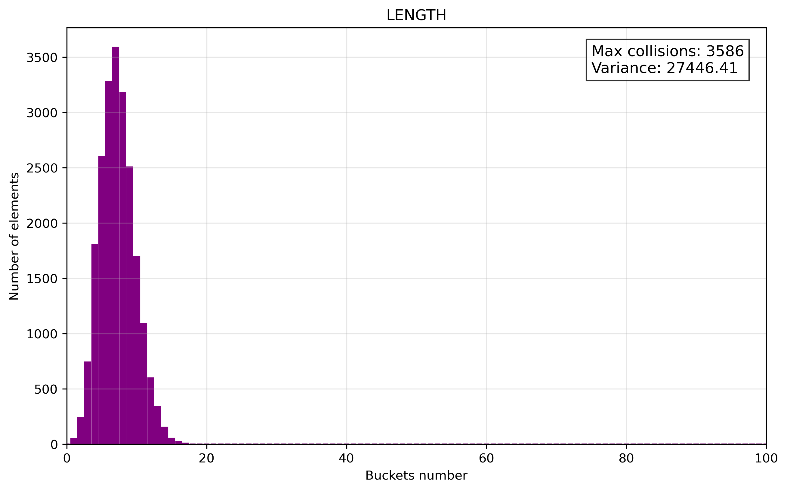
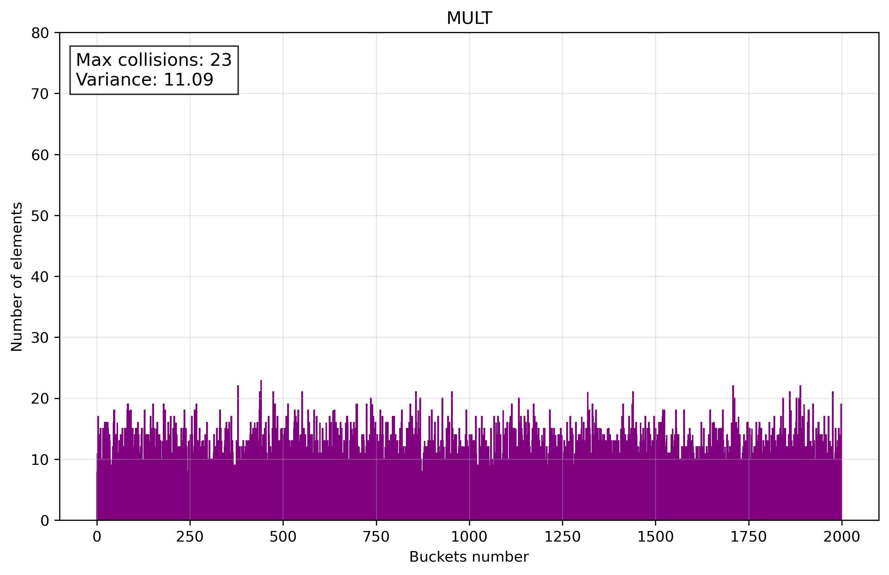

# Hash Table

## General information

Lab work on programming in the [ded32](https://github.com/ded32) course on optimizing search in a hash table.

## Context

 - [Research of hash functions](#research)
    - [LENGTH](#length)
    - [ASCII](#ascii)
    - [SUM_POS](#sumpos)
    - [MULT](#mult)
    - [DJB2](#djb)
    - [SDBM](#sdbm)
    - [CRC32](#crc)
    - [FNV_1a](#fnv)
    - [JENKINS](#jenkins)
    - [XXHASH](#xxhash)
    - [Conclusion](#conclusion)
 - [Optimization of hash table](#optimization)

 ## Research of hash functions

1. To investigate hash functions, I load `Leo Tolstoy's text “War and Peace”` into a hash table.

2. I load the number of bucket and the number of elements in it in `data.txt`.

3. I use `histo.py` to build histograms using the data from `data.txt`.

### LENGTH

Hash = length of key.

Terrible hash function, **no comments**.

### ASCII

Hash = sum of ASCII codes of each symbol.

This function is already better, but the **distribution over the buckets is uneven**.

### SUM_POS

Hash = sum of each character multiplied by its position in the string.

Improved distribution, but **it's still bad**.

### MULT

Hash = multiply the current hash by 31 and add the next character.

Introduces multiplication between iterations, **potentially improving distribution** but increasing computational cost.

### DJB2

Hash = combines a left shift and addition to multiply the hash by 33, then adds the next character in each iteration.

Uses a more **effective multiplication factor (33)** and a **non-zero initial value**.

### SDBM

Hash = adding the character to a combination of shifted hash values (left by 6 and 16 bits) and subtracting the original hash.

Employs more complex bit shifts and subtraction, which can enhance **the avalanche effect** but may be slower due to additional operations.

> [!NOTE]
> **Avalanche Effect**: A property of a hash function where a small change in the input *(e.g., flipping a single bit)* causes a significant and unpredictable change in the output hash, ideally altering approximately 50% of the bits in a random manner, ensuring better distribution and collision resistance.

### CRC32

Hash = using a lookup table and computing a cyclic redundancy check by XOR'ing the hash with each character and shifting the result.

**Leverages a precomputed table** for **better distribution** and error detection, though **it is slower** due to table lookups and bitwise operations.

### FNV_1a

Hash = XORs the hash with each character and multiplies the result by a prime number (16777619) in each iteration.

Avoids table lookups, making it **faster** while maintaining good distribution through the use of a prime multiplier.

### JENKINS

Hash = adds each character to the hash, shifts it left by 10, XORs with a right shift by 6, and finalizes with additional shifts and XORs.

Incorporates **more aggressive** bit mixing with shifts and XORs, improving the **avalanche effect** and **reducing collisions** at the cost of extra operations.

### XXHASH

Hash = multiplies each character by a seed, applies a rotation (left shift by 17), multiplies by a constant, and finalizes with a series of XORs and multiplications.

Uses a seed and **more complex finalization**.

### Conclusion

Based on the **calculated variance**, the Jenkins hash function demonstrates the **lowest variance** among the provided list, indicating a **more uniform distribution** of hash values, which makes it one of the best choices for **minimizing collisions** and ensuring **efficient performance**.
