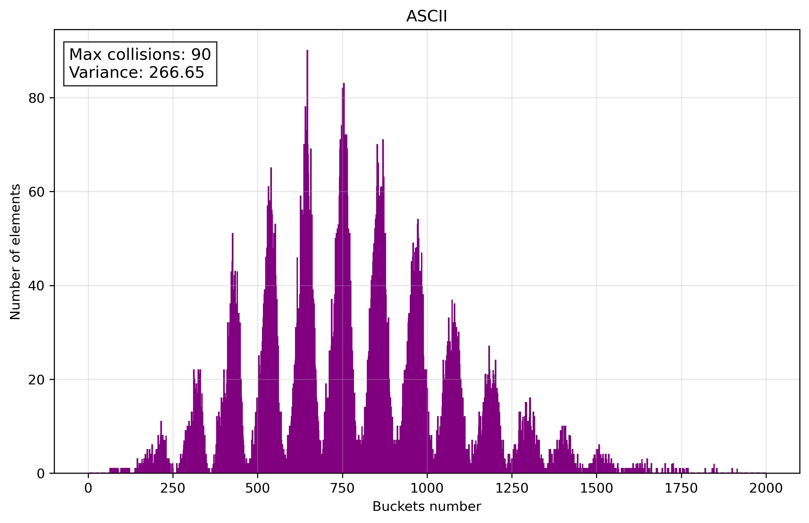

# Hash Table


# General information

Lab work on programming in the [ded32](https://github.com/ded32) course on optimizing search in a hash table.

# Context

- [Research of hash functions](#research-of-hash-functions)
    - [LENGTH](#length)
    - [ASCII](#ascii)
    - [SUM_POS](#sum_pos)
    - [MULT](#mult)
    - [DJB2](#djb2)
    - [SDBM](#sdbm)
    - [CRC32](#crc32)
    - [FNV_1a](#fnv_1a)
    - [JENKINS](#jenkins)
    - [XXHASH](#xxhash)
    - [Conclusion](#conclusion)
- [Optimization of hash table](#optimization-of-hash-table)
    - [Hardware](#hardware)
    - [Profiling and set targets](#profiling-and-set-targets)

# Research of hash functions

1. To investigate hash functions, I load `Leo Tolstoy's text “War and Peace”` into a hash table.

2. I load the number of bucket (`2000`) and the number of elements in it in `data.txt`.

3. I use `histo.py` to build histograms using the data from `data.txt`.

## LENGTH

Hash = length of key.

<details>
<summary>Click to expand/collapse</summary>

```C
static inline uint32_t hash_LENGTH (const char* key)
{
    uint32_t hash = 0;
    while (*key++)
        hash++;

    return hash;
}
```
</details>


Terrible hash function, **no comments**.

## ASCII

Hash = sum of ASCII codes of each symbol.

<details>
<summary>Click to expand/collapse</summary>

```C
static inline uint32_t hash_ASCII (const char* key)
{
    uint32_t hash = 0;
    while (*key)
        hash += (uint32_t) ((unsigned char) *key++);

    return hash;
}
```
</details>




This function is already better, but the **distribution over the buckets is uneven**.

## SUM_POS

Hash = sum of each character multiplied by its position in the string.

<details>
<summary>Click to expand/collapse</summary>

```C
static inline uint32_t hash_SUM_POS (const char* key)
{
    uint32_t hash = 0;
    int pos = 1;
    while (*key)
        hash += (uint32_t) ((unsigned char)*key++ * pos++);

    return hash;
}
```
</details>


Improved distribution, but **it's still bad**.

## MULT

Hash = multiply the current hash by 31 and add the next character.

<details>
<summary>Click to expand/collapse</summary>

```C
static inline uint32_t hash_MULT (const char* key)
{
    uint32_t hash = 1;
    while (*key)
    {
        hash *= 31;
        hash += (unsigned char)*key++;
    }

    return hash;
}
```
</details>


Introduces multiplication between iterations, **potentially improving distribution** but increasing computational cost.

## DJB2

Hash = combines a left shift and addition to multiply the hash by 33, then adds the next character in each iteration.

<details>
<summary>Click to expand/collapse</summary>

```C
static inline uint32_t hash_DJB2 (const char* key)
{
    uint32_t hash = 5381;
    unsigned char c = 0;

    while ((c = (unsigned char) *key++) != 0)
        hash = (((hash << 5) + hash) + (uint32_t) c);

    return hash;
}
```
</details>


Uses a more **effective multiplication factor (33)** and a **non-zero initial value**.

## SDBM

Hash = adding the character to a combination of shifted hash values (left by 6 and 16 bits) and subtracting the original hash.

<details>
<summary>Click to expand/collapse</summary>

```C
static inline uint32_t hash_SDBM (const char* key)
{
    uint32_t hash = 0;
    int c = 0;
    while ((c = *key++))
        hash = (uint32_t) c + (hash << 6) + (hash << 16) - hash;

    return hash;
}
```
</details>


Employs more complex bit shifts and subtraction, which can enhance **the avalanche effect** but may be slower due to additional operations.

> [!NOTE]
> **Avalanche Effect**: A property of a hash function where a small change in the input *(e.g., flipping a single bit)* causes a significant and unpredictable change in the output hash, ideally altering approximately 50% of the bits in a random manner, ensuring better distribution and collision resistance.

## CRC32

Hash = using a lookup table and computing a cyclic redundancy check by XOR'ing the hash with each character and shifting the result.

<details>
<summary>Click to expand/collapse</summary>

```C
static inline uint32_t hash_CRC32 (const char* key)
{
    uint32_t hash = 0xFFFFFFFF;
    while (*key)
    {
        uint8_t byte = (unsigned char)*key++;
        hash = (hash >> 8) ^ crc32_table[(hash ^ byte) & 0xFF];
    }

    return hash ^ 0xFFFFFFFF;
}
```
</details>


**Leverages a precomputed table** for **better distribution** and error detection, though **it is slower** due to table lookups and bitwise operations.

## FNV_1a

Hash = XORs the hash with each character and multiplies the result by a prime number (16777619) in each iteration.

<details>
<summary>Click to expand/collapse</summary>

```C
static inline uint32_t hash_FNV_1a (const char* key)
{
    uint32_t hash = 2166136261u;
    while (*key)
    {
        hash ^= (unsigned char)*key++;
        hash *= 16777619u;
    }

    return hash;
}
```
</details>


Avoids table lookups, making it **faster** while maintaining good distribution through the use of a prime multiplier.

## JENKINS

Hash = adds each character to the hash, shifts it left by 10, XORs with a right shift by 6, and finalizes with additional shifts and XORs.

<details>
<summary>Click to expand/collapse</summary>

```C
static inline uint32_t hash_JENKINS (const char* key)
{
    uint32_t hash = 0;
    while (*key)
    {
        hash += (unsigned char)*key++;
        hash += (hash << 10);
        hash ^= (hash >> 6);
    }

    hash += (hash << 3);
    hash ^= (hash >> 11);
    hash += (hash << 15);

    return hash;
}
```
</details>


Incorporates **more aggressive** bit mixing with shifts and XORs, improving the **avalanche effect** and **reducing collisions** at the cost of extra operations.

## XXHASH

Hash = multiplies each character by a seed, applies a rotation (left shift by 17), multiplies by a constant, and finalizes with a series of XORs and multiplications.

<details>
<summary>Click to expand/collapse</summary>

```C
static inline uint32_t hash_XXHASH (const char* key)
{
    uint32_t hash = 0;
    uint32_t seed = 0x1e3b2d4f;
    while (*key)
    {
        uint32_t c = (unsigned char)*key++;
        hash += c * seed;
        hash = (hash << 17) | (hash >> 15);
        hash *= 0x9e3779b1;
    }

    hash ^= hash >> 15;
    hash *= 0x85ebca77;
    hash ^= hash >> 13;
    hash *= 0xc2b2ae3d;
    hash ^= hash >> 16;

    return hash;
}
```
</details>


Uses a seed and **more complex finalization**.

## Conclusion

Based on the **calculated variance**, the **JENKINS** hash function demonstrates the **lowest variance** among the provided list, indicating a **more uniform distribution** of hash values, which makes it one of the best choices for **minimizing collisions** and ensuring **efficient performance**.

**BUT**, in the training framework, for simplicity, we will use **CRC32**. It's not that bad, but it's statistically slightly worse than **JENKINS**. For JENKINS or any other function, we'll have to implement **complex logic in assembly**, which we don't have enough class time for.

# Optimization of hash table

## Hardware

- **Compiler:** `g++ 13.3.0`
- **Processor:** `AMD Ryzen 5 4500U 2.3 GHz (4 GHz in Turbo)`
- **OS:** `Ubuntu 24.04.2 LTS`
- **Profiler:** `valgrind 3.22.0`
- **To visualize profiling data:** `kcachegrind 23.08.5`

## Profiling and set targets

Using `valgrind` to get the program's hot spots:


Our optimization targets:

### 1. hash_CRC32

Find and implement a way to speed up hash calculation.

### 2. strcmp

In our case all words in the hash table are of a certain length, so we can write `strcmp` version for our case.

After this steps we should check the program hot spots again.
